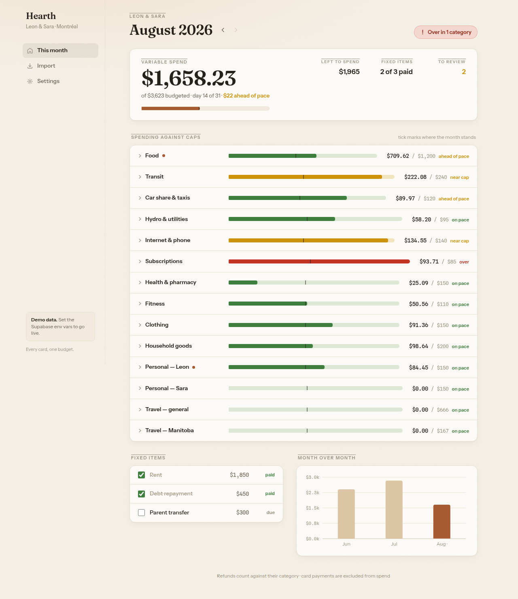
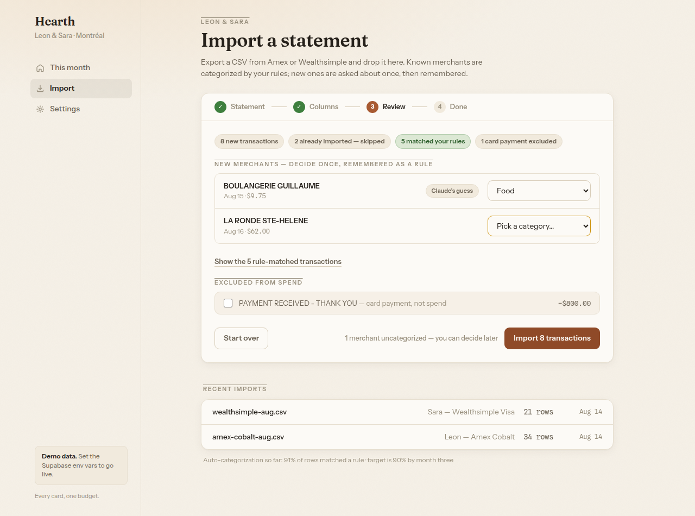
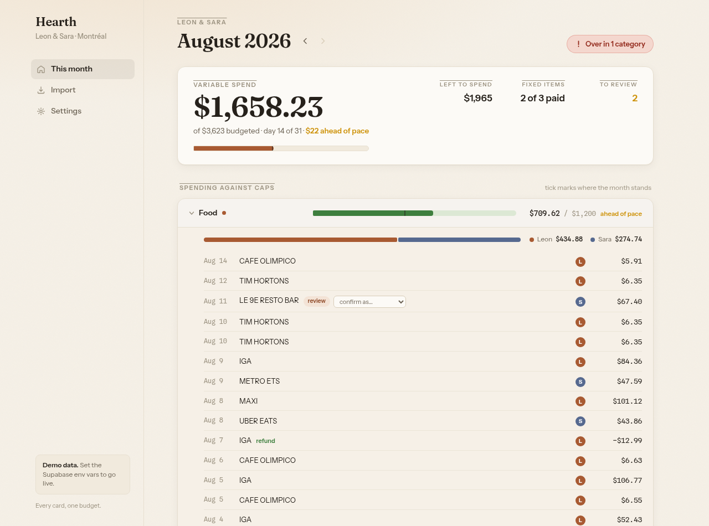

# Hearth — household budget tracker

Spend is deliberately split across cards for rewards, so no single provider dashboard can
see all of it. Hearth is the answer: export a CSV from each card, drop it in, and know in
five seconds whether the month is on track.

Built to the [PRD](docs/PRD.md) (v1.1, amended per [review](docs/PRD-REVIEW.md)).



## Run it

```bash
npm install
npm run dev       # http://localhost:3000 — demo mode with seeded data
npm test          # import-engine fixture tests
npm run build     # production build
```

With no Supabase env vars the app runs in **demo mode**: an in-memory store seeded with
three months of realistic Montreal data, so every flow — dashboard, import wizard,
settings — works out of the box. The import page has a bundled sample Amex export to
try the whole flow.

## Going live

1. Create a Supabase project and run `supabase/migrations/0001_init.sql` (tables, RLS
   via a `security definer` membership function, cap-snapshot trigger).
2. Copy `.env.example` to `.env.local` and fill in `NEXT_PUBLIC_SUPABASE_URL`,
   `NEXT_PUBLIC_SUPABASE_ANON_KEY`, and (optional) `ANTHROPIC_API_KEY` — without the
   Anthropic key, first-pass categorization falls back to a local heuristic dictionary.
3. Deploy to Vercel.

Live mode is fully wired: magic-link sign-in (`/signin`, session refresh in
`proxy.ts`), first-run onboarding at `/welcome` (create a household with the 17 seeded
lines, or accept a pending invite addressed to your email), sign-out, and source
creation from the import page. Household creation is a single `security definer` RPC
(household + owner membership + seeded categories, atomically); joining any other
household requires a pending invite for your email, with the role pinned to what the
invite grants and invite updates column-restricted to `accepted_at`. Remaining before
trusting it with real data: run `supabase/rls-checklist.sql` against a live project —
the policies are written and reviewed, not yet penetration-tested for real.

## How it's put together

| Piece | Where | Notes |
|---|---|---|
| Import engine | `lib/import/` | Pure TypeScript, no I/O. Parsing, sign canonicalization, merchant normalization, count-aware dedup, exact-match rules. 17 fixture tests. |
| Claude categorization | `lib/import/categorize.ts` | One batched Haiku call per import, server-side; merchant strings only, never amounts. |
| Data access | `lib/data/` | One interface, two stores: seeded in-memory demo and Supabase. |
| Budget math | `lib/budget.ts` | Color = proximity to cap; pace is a separate text flag needing ≥3 transactions so early bills stay quiet. |
| Schema | `supabase/migrations/` | Amended data model: `month_caps` snapshots, `invites`, canonical sign convention, instrumentation counts. |

Import review — unknown merchants are decided once, then remembered as rules:



Category detail — per-person split, refunds, and unreviewed transactions inline:



## Conventions that matter

- **Money is integer cents.** Spend positive, credits negative, canonicalized at import.
- **Dedup is count-aware.** Two identical same-day coffees are two transactions;
  re-uploading an overlapping statement double-counts nothing.
- **Card payments are excluded from spend** by default (override at review); refunds
  count as negative spend in their category.
- **Cap edits never rewrite history** — each month keeps the caps it was measured against.
